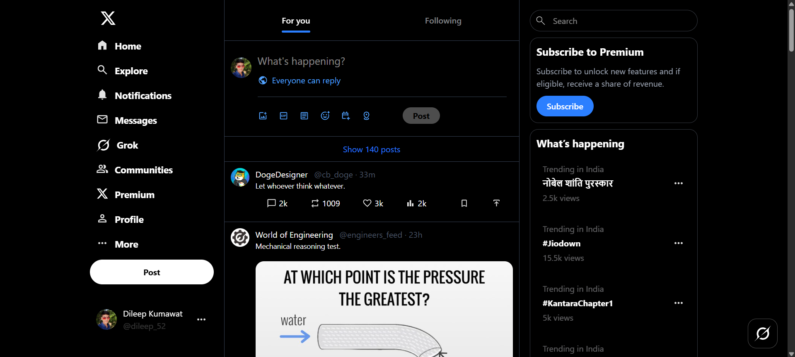

# X.com Clone with Tailwind CSS 🇮🇳

A fully responsive landing page clone of **X.com**, built with HTML, Tailwind CSS, and modern design practices.

---

## 🚀 Live Demo

https://dileep-kumawat.github.io/X.com-using-tailwind/

---

## 📸 Preview



---

## 🧱 Built With

- **HTML5**
- **Tailwind CSS** (v4.x) – Utility-first framework for composing modern

---

## ✨ Key Features

- Responsive design across mobile, tablet, and desktop.
- Utility-first styling with Tailwind’s flexible classes.
- Simple, modular folder structure—easy to maintain and scale.
- Pre-configured `tailwind.config.js` for custom colors, fonts, and breakpoints.

---

## 🛠️ Getting Started

### Prerequisites

- Node.js & npm (if you plan to rebuild CSS using Tailwind CLI)

### Installation

```bash
git clone https://github.com/Dileep-kumawat/X.com-using-tailwind.git
cd X.com-using-tailwind
npm install
